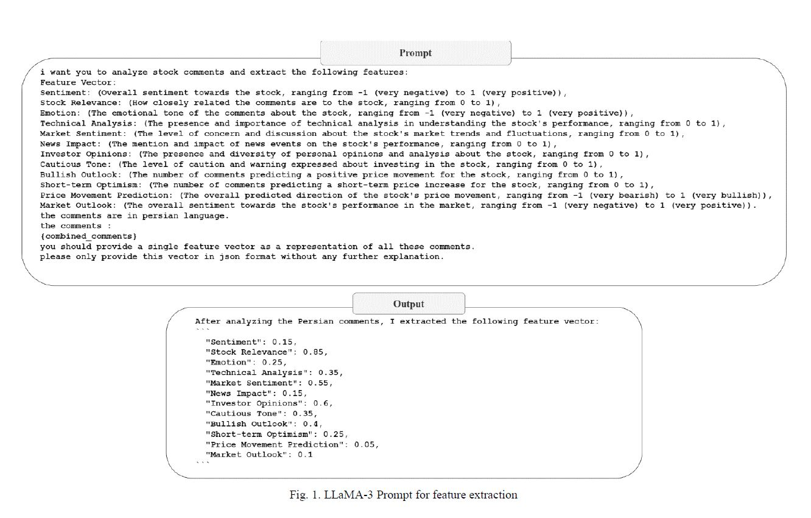

# LLM-Driven Dataset-Tehran Stock Exchange
This repository contains data for the top 40 traded stocks in the Tehran Stock Exchange, along with their extracted financial features as described in our research paper.


## **Description**
The features were extracted using the LLaMA-3-70B language model. The full prompt used for feature extraction is embedded in the following figure, which outlines the overall process:

To support and accelerate research in this field, we decided to publish this dataset and its features. We hope it provides sufficient information for researchers working on text-based stock prediction models for the Tehran Stock Exchange, helping to reduce both time and computational cost.
## **Citation**
If you use this dataset in your research or work environment, please cite our paper:
```bibtex
@inproceedings{saffarian2024llm,
  title={LLM-Driven Feature Extraction for Stock Market Prediction: A Case Study of Tehran Stock Exchange},
  author={Saffarian, Siavash Hosseinpour and Haratizadeh, Saman},
  booktitle={2024 15th International Conference on Information and Knowledge Technology (IKT)},
  pages={59--65},
  year={2024},
  organization={IEEE}
}
